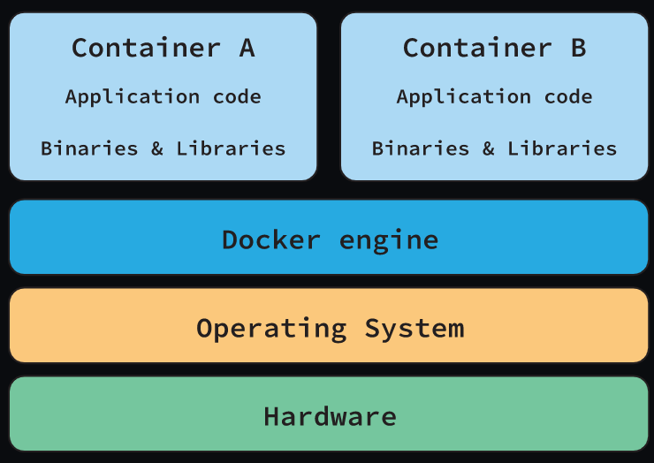
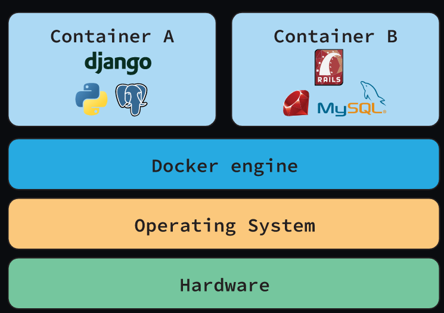
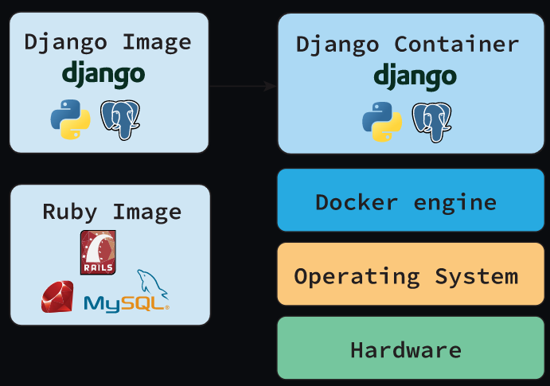
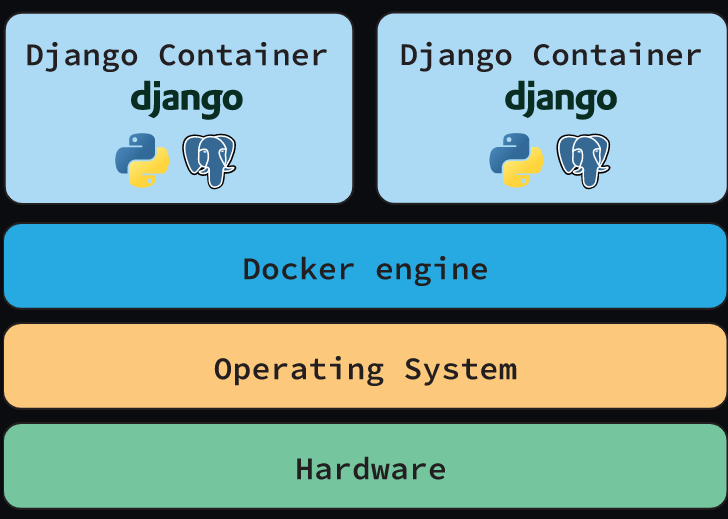
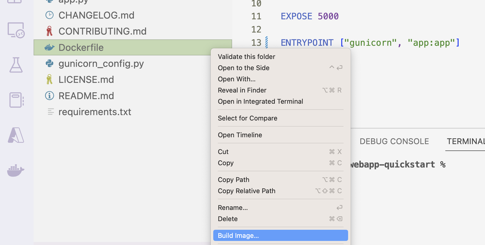
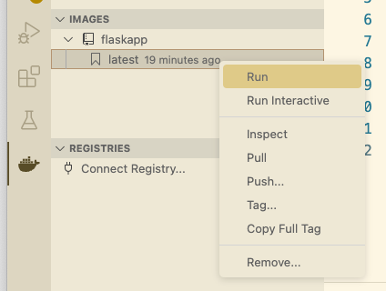
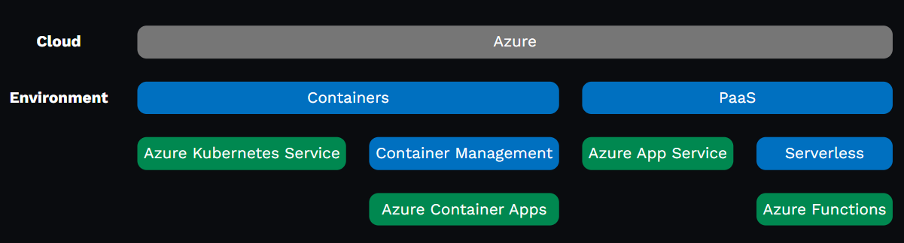
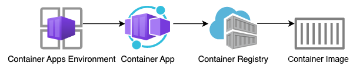
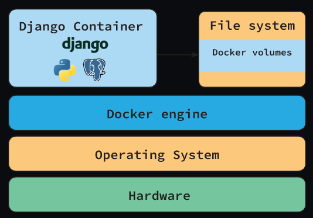

Containerizing Python Web Apps with Docker
    
    aka.ms/pyday-containers

    A container is a standard way to package an application with all of its dependencies, so that it can be run anywhere.

    Docker overview

        The Docker engine runs multiple Docker containers, where each container is an isolated environment.

        Each container can be a very different environment, with binaries and libraries dependent on the application.

    Container benefits
        
        Environment consistency: Ensure that the dev, test, prod environment are the same.

        Application portability: Easy to run the application on new hardware if old hardware fails or if application needs to scale.

        Efficient hardware use: A machine can run multiple containers to make optimal use of its resources.

    Docker images
        
        A container image is a software package that includes everything needed to run an application.
        
        A container is a running instance of a container image.
    

        Multiple containers can be run from the same image.

    Image registries: A registry is a place to store and share images.
        Docker Hub: contains many images, including official images for python, postgres, Unix systems, etc.
        GitHub, Azurem AWS, Google Cloud container registry
        Private (Proget, JFrog)
    
    Image layers: A container image often starts off with a base image, and then adds layers on top of it.
        For example:
            Base image: Ubuntu 20.04
            Layer 1: Python 3.9
            Layer 2: Flask 2.0
            Layer 3: Your app
        
        Docker can cache each layer, which improves performance.

Productionizing Flask apps    

    Sample Flask app: github.com/pamelafox/simple-flask-server-container-starter
        from flask import Flask, render_template, request

        app = Flask(__name__, template_folder='templates', static_folder='static')

        @app.route('/')
        def index():
            return render_template('index.html')

        @app.route('/hello')
        def hello():
            return render_template('hello.html', name=request.args.get('name'))

    pip install -r requirements.txt
    
    Running Flask app locally, Using the built-in Flask server:
        python3 -m flask run --port 50505 --debug

    Running Flask with gunicorn
        Gunicorn is a production-level server that can run multiple worker processes.
        
        Add gunicorn to requirements.txt:
            Flask==2.2.3
            gunicorn==20.1.0
        
        Use gunicorn to run Flask app with multiple workers:
            python3 -m gunicorn app:app --workers 4 --bind 0.0.0.0:50505
    
    Configuring gunicorn, Gunicorn can be configured with a gunicorn.conf.py file:
        import multiprocessing
            
        max_requests = 1000
        max_requests_jitter = 50
        log_file = "-"
        bind = "0.0.0.0:50505"

        workers = (multiprocessing.cpu_count() * 2) + 1
        threads = workers
        timeout = 120

    The run command can be simplified to: python3 -m gunicorn app:app

Containerizing Flask apps

    Containerization steps
        Write a Dockerfile
        Build image from Dockerfile
        Run container using built image

    Dockerfile format, A Dockerfile includes:
        The base or parent image*	            FROM python:3.11
        Additional software	                    RUN pip3 install Flask gunicorn
        Application code	                    WORKDIR /code
                                                COPY . .
        Services to expose (storage/network)	EXPOSE 50505
        Command to run upon launching container	ENTRYPOINT ["gunicorn", "-c", "gunicorn.conf.py", "app:app"]
        
    Dockerfile for Flask, A complete file:
        FROM python:3.11
        WORKDIR /code
        COPY requirements.txt .
        RUN pip3 install -r requirements.txt
        COPY . .
        EXPOSE 50505
        ENTRYPOINT ["gunicorn", "-c", "gunicorn.conf.py", "app:app"]

    Add a dockerignore file, Prevent unnecessary files from being copied to the image:
        .git*
        .venv/
        **/*.pyc
        __pycache__/

Building the image, Using the docker build command:
    docker build --tag flaskapp .

    Using the VS Code Docker extension
    

Running the container, Using the docker run command:
    docker run --publish 50505:50505 flaskapp

    Using VS Code Docker extension or Docker Desktop

Hosting containers on Azure

    Azure hosting options
        For hosting containers, Kubernetes Service, Container Apps, and App Service (BYOC) are all good options.

    Hosting on Azure Container Apps
        A Container Apps Environment manages a Container App.
    

        Flask container architecture diagram: Azure Container Apps Environment, Azure Container App, Azure Container Registry, Container, and PostgreSQL Server
        
        The Container App pulls its image from an Azure Container Registry. (Other registries are also possible)

    Deploying to ACA with Azure CLI
        Install the Azure Developer CLI (already installed in Dev Container).
        
        Login to your Azure account: az login or az login --use-device-code
        
        Create a resource group: az group create --name flaskapp-rg --location eastus
        
        Create resources and deploy the app:
            az containerapp up --resource-group flaskapp-rg --name flaskapp-aca \
                --ingress external --target-port 50505 --source .
        
    Deploying to ACA with AZD
        Using this repo (with Bicep files in infra folder): github.com/pamelafox/simple-flask-server-container
        
        Install the Azure Developer CLI (already installed in Dev Container).
        
        Login to your Azure account: azd auth login
        
        Create resources and deploy the app: azd up
    
    Clean up the resources, through portal or azd down
    
    Accessing databases from containers

        Sample Flask app with DB: github.com/pamelafox/flask-surveys-container-app    
            @app.route('/surveys', methods=['GET'])
            def surveys_list_page():
                return render_template('surveys_list.html', surveys=Survey.query.all())

            @app.route('/surveys/', methods=['GET'])
            def survey_page(survey_id):
                survey = Survey.query.where(Survey.id == survey_id).first()
                answers = Survey.query.where(Answer.survey==survey_id)
                return render_template('survey_details.html', survey=survey, answers=answers, already_voted='survey_id' in request.cookies)
    
    Data persistence in containers
        Data can be written to a container's file system, but:
            Removing a container removes the data
            Container data is difficult to move between environments
            Container storage drives are less performant
            If you need to persist data, you should store it outside the container.

    Docker volumes - A volume is a directory on the host machine that is mapped to a directory in the container.
        
        Diagram of Docker container and Docker volumes inside the File System
            
        
        When developing with databases locally, use a volume to store the data for the database.        

    Running PostgreSQL with Docker
        Create a volume: docker volume create postgres-data

        Create a network for the containers to communicate over: docker network create postgres-net

        Run a PostgreSQL container with the volume and network:
            docker run --rm -d --name db --network postgres-net \
                -v postgres-data:/var/lib/postgresql/data \
                -e POSTGRES_USER=app_user -e POSTGRES_PASSWORD=app_password \
                postgres

    Connecting the app to the DB
        Set environment variables for the database connection:
            DBHOST=db
            DBNAME=postgres
            DBUSER=app_user
            DBPASS=app_password

        Build the container: docker build --tag flasksurveyscontainerapp src/

        Run the app container over the same network:
            docker run --rm --name flask-db-app --network postgres-net \
                --env-file .env -p 50505:50505 \
                flasksurveyscontainerapp            

Docker compose
    Docker compose is a tool for multi-container Docker apps.
    docker-compose.yaml defines the services that make up your app:

        services:
            db:
                image: postgres
                restart: always
                environment:
                    POSTGRES_PASSWORD: ${DBPASS:?database password not set}
                    POSTGRES_USER: ${DBUSER:?database user not set}
                    POSTGRES_DB: ${DBNAME:?database name not set}
                volumes:
                    - postgres-data:/var/lib/postgresql/data
                healthcheck:
                    test: ["CMD-SHELL", "pg_isready -U ${DBUSER} -d ${DBNAME}"]
                    interval: 5s
                    timeout: 5s
                    retries: 5
            app:
                build:
                    context: .
                ports:
                    - 5000:5000
                depends_on:
                    db:
                        condition: service_healthy
            volumes:
                postgres-data:            

    Run multiple containers, Run the app and database containers: docker-compose up         

Hosting containers with databases on Azure
    
    Storage in container apps

        For temporary storage, you can write to file system or have an ephemeral volume in a container app.
    
        For permanent storage, you can mount Azure Files but performance is too limited to be useful for a database.

        Best approach for Azure: Use a managed database service outside the container.
    
    Azure managed databases services, These are just some of the options:
        Option	                        Description
        Azure CosmosDB	                Distributed database with multiple APIs, including MongoDB and Cassandra.
        Azure Cosmos DB for PostgreSQL	Distributed database using PostgreSQL and the Citus extension. 
                                        Can scale vertically and horizontally.
        Azure Database for PostgreSQL   Fully managed service 
        – Flexible Server	

    Containerized App with PostgreSQL access
        

    Deploying to ACA + PG with AZD using Azure
        Install the Azure Developer CLI (already installed in Dev Container).

        Login to your Azure account: azd auth login
        
        Create resources and deploy the app: azd up

    Clean up the resources, through portal or azd down.    

More containerized Python templates
    
    Find lots of examples in the AZD templates gallery:
        https://azure.github.io/awesome-azd/?operator=AND&tags=python&tags=aca